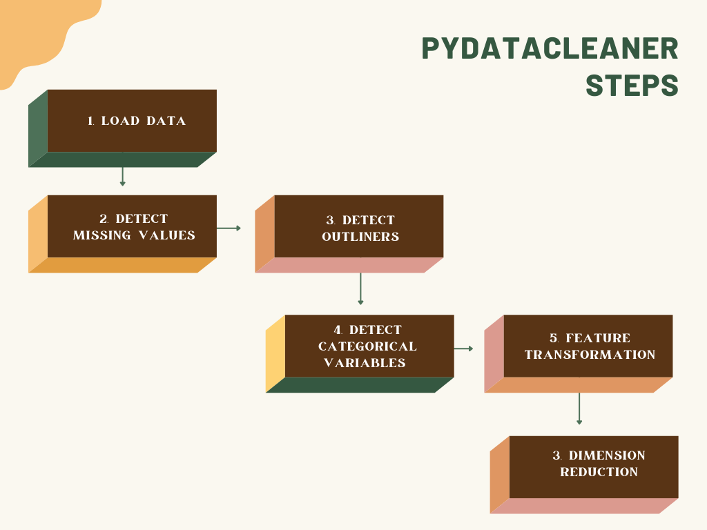
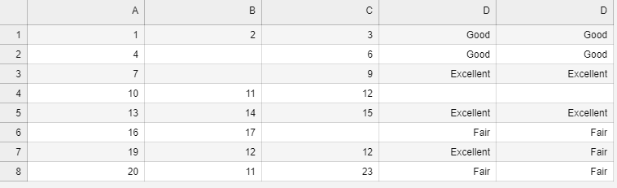
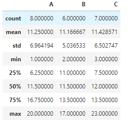
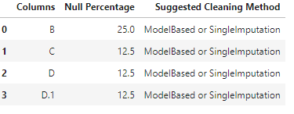
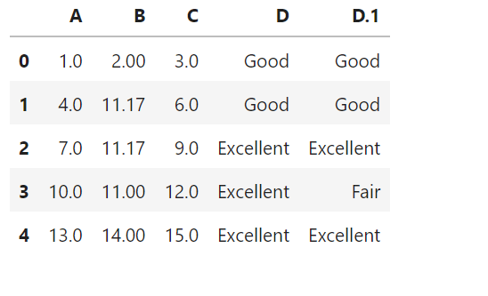
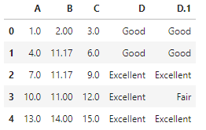
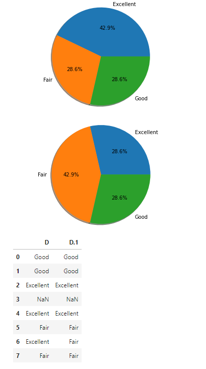
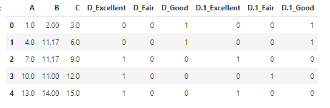
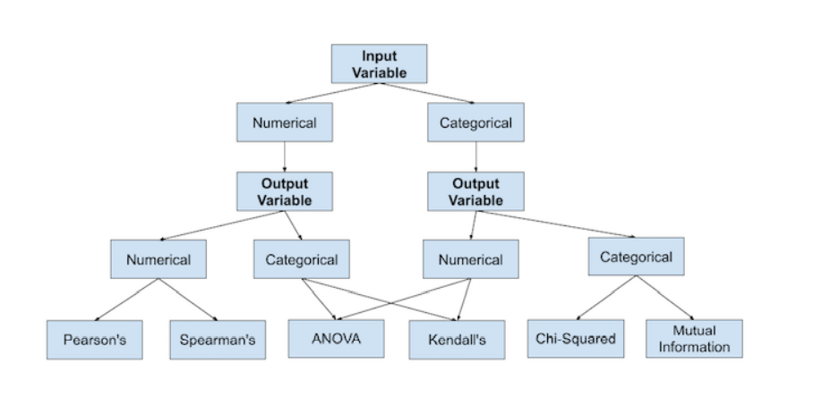

# PyDataCleaner Docs

pyDataCleaner is a simple utility tool that helps automate the data cleaning process for data modeling

## commonly used data cleaning steps




## Features provided by this mini

1. Load a dataset with any of these types
    - CSV, JSON, XLSX, XLS, DAT
2. Detect missing values and apply necessary imputation techniques
3. Detect outliers and apply the necessary removal techniques
4. Detect Categorical features and apply encoding techniques 
5. Feature transformation and selection techniques to create new features and choose a specific set 
   of variables that best represent the data characteristics


File Structure 

```
project
│   
└───pyDataCleaner
│   │   __init__.py
│   │   cleaner.py
│   │   dimen_reduction.py
│   │   feature_selection.py
│   │   
│   └───images
│       │   *.png/jpg/jpeg/gif/svg/webp
│   
└───README.md
```

There are only a few classes in this modules most people will only be working with the `AutoCleaner` class, 
which as the name suggests automates all the tiresome work and gives you an elegant API to work with. <br>

### Example 1
<b>For this example</b> `Lets say there is a dataset "datasets/test.csv"`

    



#### First step is create an instance of the `AutoCleaner` class and pass in the path to the dataset 
```python
# create an AutoCleaner Object

cleaner = AutoCleaner(
    path_to_the_dataset
)

# If before starting on cleaning you to see some analysis or description about the data

cleaner.describe_data()
```
 <br>

```
# to see recommended missing value imputation techniques we could youse the `suggest_cleaning_options` method
# eg. ModelBased, Removal, Single Imputation techniques

cleaner.suggest_cleaning_options()
```



```
'''
The next step would be to handle the missing values based on the recommended methods or any other method you provide. 
The below is the method definition for 

def handle_missing_values(
    self,
    columns: list = None,
    strategy: str = None,
    drop_numerical: list = False,
    drop_non_numerical: list = False,
    axis: int = 1,
    missing_values=np.nan,
):

1. columns: `list` : List of columns you want to consider for the data cleaning this matters if you don't 
   want certain columns to be left untouched. (if not provided it will use all the dataframe's columns).

2. strategy: `str` : this is a string parameter for the imputation method. 
   ["mean", "median", "most_frequent", "constant"]. If not provided `mean` will be used as the default strategy.

3. drop_numerical: `list` : List of columns that you want to drop from the dataframe 
   (it is dependent on the axis parameter to either remove rows or the entire column). 
   (default is None, and will not drop any columns).

4. drop_non_numerical: `list` : List of columns that you want to drop from the dataframe 
   (it is dependent on the axis parameter to either remove rows or the entire column). 
   (default is None, and will not drop any columns).

5. axis: `int` : axis of the dataframe that you want to impute. (default is 1, which means it will impute the rows).

6. missing_values: List | type : the value that you want to impute. 
   (default is np.nan, which means it will impute with the mean of the column).

'''

## Lets continue the above example
## In this case we consider all the columns so we don't need to pass the columns parameter
## the axis to be 1 which means we want to impute the rows
## the strategy to be "mean" which means we want to impute with the mean of the column
## the missing_values to be np.nan [which means the np.nan values are considered to be empty values]


cleaner.handle_missing_values(
    strategy="mean",
    axis=1,
    missing_values=np.nan,
).temp_df.head()

```



```python
'''
As you can see from the above image there are no missing values in the dataset.

If you watched closely we added .temp_df after the function call, when ever you call a function in AutoCleaner 
class it will not affect the main dataframe but an underlying one called `temp_df`.

If you want to persist the changes made by the function to the main dataframe you can use the `.commit()` after any method call.
and you can also chain the methods together to perform multiple operations on the dataframe.

'''
```


The next step is to detect outliers. There is a member method in the AutoCleaner class called `handle_outliers` 
which we can use to detect and handle outliers in our dataset.

```

cleaner.handle_outliers()

```



The next step is to detect categorical features and apply encoding techniques. There is a member method in the AutoCleaner class called

`detect_categorical_columns` which we can use to detect categorical features in our dataset.

```python
'''

def detect_categorical_columns(
    self, 
    plot: bool = True
)

'''
cat_df = cleaner.detect_categorical_columns()
cat_df.temp_df.head()
```



After the categorical features are detected we would want to encode the data. The `encode_categorical_columns` 
in the AutoCleaner class does this for you.

```python
'''
def encode_categorical_columns(
    self, 
    encoding_type, 
    replace_map: dict = None
):
'''
# encoding_type => ["replace", "one-hot", "label" ]
# replace_map => a dictionary that will be used to map the categorical values.

cleaner.encode_categorical_columns("one-hot").temp_df.head()

```


<b>Lets not forget we have not still use `.commit()` to persist our dataframe</b>
#### NB
if you do not want to call all the functions in the AutoCleaner class you can use `auto_clean` 
function to perform all the steps in one go. 
(but this is not recommended, its better to customize the hyperparameters as it suits your needs)

<br>

### Feature transformation 

Feature selection methods are intended to reduce the number of input variables to those that are believed
to be most useful to a model in order to predict the target variable. Some predictive modeling problems 
have a large number of variables that can slow the development and training of models and require a large 
amount of system memory. Additionally, the performance of some models can degrade when including input 
variables that are not relevant to the target variable.



### For categorical input and out features we can use 

The feature transformation methods are are included in a separate file `feature_selector.py` which 
could be imported separately from `AutoCleaner`.

1. Chi-Squared Statistic.
2. Mutual Information Statistic.

<br>

```python
'''
def categorical_feature_selection(
    df: pd.DataFrame,
    labels,
    test_size,
    selection_func,
    k="all",
) -> tuple(pd.DataFrame, pd.DataFrame):
'''

We can use the bare pandas api to read data or use AutoCleaner's object to read the data and access the 
dataFrame using `obj.df` and pass it to the function.

`params`

1. df: pd.DataFrame : a pandas DataFrame
2. labels: List : a list of labels of the dataframe, this field is required and will be used to identify the features.
3. test_size: the test size that will be used to split training and testing set during modeling.
4. selection_func: Function : a selection function in this case either (mutual_info_classif) or (chi2)

'''
```

### Select Features for Numerical Input and Output data

common ways for selecting features for numerical input and output data are:
- correlation statistics 
- mutual information statistics

```python           
'''
def numerical_feature_selection(
    df, 
    labels, 
    test_size, 
    percentage, 
    k, 
    selection_function=f_regression
) -> tuple(pd.DataFrame, pd.DataFrame):

params: 
    `df`: DataFrame
    `test_size` : test_size from 0 - 1
    `percentage` : train and test splitting percentage
    `k` : number of features that will be selected
    `selection_function` : A selection function if not provided default is ["f_regression", "mutual_info_regression"]
                           from the `sklearn.feature_selection` module. 
    `labels` : list of column names that the model will try to predict
======================================================

## We could use a linear regression model to see how well our selected features perform.

# using the `test_regression` function

def test_regression_model(
    x_train_ts,
    x_test_ts,
    y_train,
    y_test,
):

'''

```

### In a more general note there is a function called `feature_selection` 

```
'''
def feature_selection(
    df: pd.DataFrame,
    labels,
    test_size,
    selection_func,
    k="all",
) -> tuple(pd.DataFrame, pd.DataFrame):

params: 
    `df`: DataFrame
    `test_size` : test_size from 0 - 1
    `percentage` : train and test splitting percentage
    `k` : number of features that will be selected
    `selection_function` : A selection function if not provided default is f_regression/mutual_info_regression 
                           from the `sklearn.feature_selection` module. 
    `labels` : list of column names that the model will try to predict

All that is needed is to call the function and pass the dataframe and the labels. Along with the
test size and the selection function. and a tuple will be returned with the training and testing dataframes.

'''
```

<!-- ## Dimensionality reduction  -->

<!-- TODO:  add dimensionality reduction (adding currently) -->
